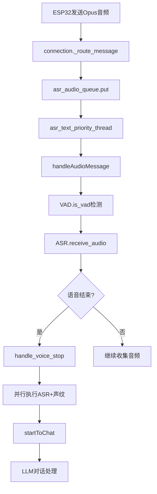

# 🎤 xiaozhi-server VAD和ASR模块深度技术解析

## 📋 目录

1. [项目架构概览](#项目架构概览)
2. [VAD (语音活动检测) 模块](#vad-语音活动检测-模块)
3. [ASR (自动语音识别) 模块](#asr-自动语音识别-模块)
4. [调用链路详解](#调用链路详解)
5. [关键设计亮点](#关键设计亮点)

---

## 🏗️ 项目架构概览

### xiaozhi-server 总体架构层次

```
xiaozhi-server/
├── app.py                     # 应用程序入口
├── core/                      # 核心模块
│   ├── websocket_server.py    # WebSocket服务器
│   ├── connection.py          # 连接处理器
│   ├── http_server.py         # HTTP服务器
│   ├── handle/               # 消息处理模块
│   ├── providers/            # AI服务提供者
│   └── utils/               # 工具模块
├── config/                   # 配置管理
└── plugins_func/            # 插件系统
```

### 核心启动流程

```python
# app.py 启动顺序
main() -> 
├── check_ffmpeg_installed()     # 检查FFmpeg
├── load_config()                # 加载配置 
├── WebSocketServer(config)      # 创建WebSocket服务器
├── SimpleHttpServer(config)     # 创建HTTP服务器
└── wait_for_exit()              # 等待退出信号
```

### 模块层次结构

```
core/providers/
├── vad/
│   ├── base.py           # VAD抽象基类
│   └── silero.py         # Silero VAD实现
└── asr/
    ├── base.py           # ASR抽象基类
    ├── fun_local.py      # 本地FunASR实现
    ├── doubao_stream.py  # 豆包流式ASR实现
    └── dto/dto.py        # ASR数据传输对象
```

---

## 🎯 VAD (语音活动检测) 模块

### 1. 基类设计 (vad/base.py)

```python
class VADProviderBase(ABC):
    @abstractmethod
    def is_vad(self, conn, data) -> bool:
        """检测音频数据中的语音活动"""
        pass
```

**设计特点**:
- 极简抽象接口，只有一个核心方法
- 返回布尔值，表示当前音频帧是否包含语音
- 接收连接对象和音频数据作为参数

### 2. Silero VAD实现 (vad/silero.py)

#### 初始化过程

```python
class VADProvider(VADProviderBase):
    def __init__(self, config):
        # 1. 加载Silero VAD模型
        self.model, _ = torch.hub.load(
            repo_or_dir=config["model_dir"],
            source="local",
            model="silero_vad",
            force_reload=False,
        )
        
        # 2. 初始化Opus解码器
        self.decoder = opuslib_next.Decoder(16000, 1)
        
        # 3. 配置阈值参数
        self.vad_threshold = 0.5        # 高阈值
        self.vad_threshold_low = 0.2    # 低阈值  
        self.silence_threshold_ms = 1000 # 静默时长阈值
        self.frame_window_threshold = 3  # 连续帧阈值
```

#### 核心检测算法

```python
def is_vad(self, conn, opus_packet):
    # 1. Opus解码为PCM
    pcm_frame = self.decoder.decode(opus_packet, 960)
    conn.client_audio_buffer.extend(pcm_frame)
    
    # 2. 批量处理512采样点帧
    while len(conn.client_audio_buffer) >= 512 * 2:
        chunk = conn.client_audio_buffer[:512 * 2]
        conn.client_audio_buffer = conn.client_audio_buffer[512 * 2:]
        
        # 3. 格式转换
        audio_int16 = np.frombuffer(chunk, dtype=np.int16)
        audio_float32 = audio_int16.astype(np.float32) / 32768.0
        audio_tensor = torch.from_numpy(audio_float32)
        
        # 4. VAD推理
        with torch.no_grad():
            speech_prob = self.model(audio_tensor, 16000).item()
        
        # 5. 双阈值判断 (防止频繁切换)
        if speech_prob >= self.vad_threshold:      # 高阈值 -> 有语音
            is_voice = True
        elif speech_prob <= self.vad_threshold_low: # 低阈值 -> 无语音
            is_voice = False
        else:                                       # 中间值 -> 维持前状态
            is_voice = conn.last_is_voice
        
        # 6. 滑动窗口平滑
        conn.client_voice_window.append(is_voice)
        client_have_voice = (
            conn.client_voice_window.count(True) >= self.frame_window_threshold
        )
        
        # 7. 静默检测 (语音结束判断)
        if conn.client_have_voice and not client_have_voice:
            stop_duration = time.time() * 1000 - conn.last_activity_time
            if stop_duration >= self.silence_threshold_ms:
                conn.client_voice_stop = True
```

#### 关键设计亮点

1. **双阈值机制**: 防止在阈值边界频繁切换状态
2. **滑动窗口**: 连续3帧才认定为有语音，减少噪声干扰
3. **渐进式处理**: 逐帧处理，支持实时检测
4. **状态记忆**: 保存上一次状态，平滑过渡

### 3. VAD状态管理

```python
# ConnectionHandler中的VAD相关状态
class ConnectionHandler:
    # 音频缓冲区
    self.client_audio_buffer = bytearray()
    
    # VAD状态
    self.client_have_voice = False      # 当前是否有语音
    self.client_voice_stop = False      # 语音是否结束
    self.last_is_voice = False          # 上一帧是否有语音
    self.last_activity_time = 0.0       # 最后活动时间
    
    # 滑动窗口 (最近5帧)
    self.client_voice_window = deque(maxlen=5)
```

---

## 🗣️ ASR (自动语音识别) 模块

### 1. 基类设计 (asr/base.py)

#### 抽象接口

```python
class ASRProviderBase(ABC):
    @abstractmethod
    async def speech_to_text(
        self, opus_data: List[bytes], session_id: str, audio_format="opus"
    ) -> Tuple[Optional[str], Optional[str]]:
        """将语音数据转换为文本"""
        pass
```

#### 通用音频处理功能

```python
class ASRProviderBase:
    # 1. 音频通道管理
    async def open_audio_channels(self, conn):
        conn.asr_priority_thread = threading.Thread(
            target=self.asr_text_priority_thread, args=(conn,), daemon=True
        )
        conn.asr_priority_thread.start()
    
    # 2. 优先级音频处理线程
    def asr_text_priority_thread(self, conn):
        while not conn.stop_event.is_set():
            try:
                message = conn.asr_audio_queue.get(timeout=1)
                future = asyncio.run_coroutine_threadsafe(
                    handleAudioMessage(conn, message), conn.loop
                )
                future.result()
            except queue.Empty:
                continue
    
    # 3. 音频数据接收
    async def receive_audio(self, conn, audio, audio_have_voice):
        conn.asr_audio.append(audio)
        
        if conn.client_voice_stop:
            asr_audio_task = conn.asr_audio.copy()
            conn.asr_audio.clear()
            conn.reset_vad_states()
            
            if len(asr_audio_task) > 15:
                await self.handle_voice_stop(conn, asr_audio_task)
```

### 2. 并行处理架构 (ASR + 声纹识别)

#### 核心处理流程

```python
async def handle_voice_stop(self, conn, asr_audio_task: List[bytes]):
    """并行处理ASR和声纹识别"""
    
    # 1. 音频预处理
    if conn.audio_format == "pcm":
        pcm_data = asr_audio_task
    else:
        pcm_data = self.decode_opus(asr_audio_task)
    
    combined_pcm_data = b"".join(pcm_data)
    
    # 2. 声纹识别数据准备
    wav_data = None
    if conn.voiceprint_provider and combined_pcm_data:
        wav_data = self._pcm_to_wav(combined_pcm_data)
    
    # 3. 定义并行任务
    def run_asr():
        loop = asyncio.new_event_loop()
        asyncio.set_event_loop(loop)
        try:
            result = loop.run_until_complete(
                self.speech_to_text(asr_audio_task, conn.session_id, conn.audio_format)
            )
            return result
        finally:
            loop.close()
    
    def run_voiceprint():
        if not wav_data:
            return None
        loop = asyncio.new_event_loop()
        asyncio.set_event_loop(loop)
        try:
            result = loop.run_until_complete(
                conn.voiceprint_provider.identify_speaker(wav_data, conn.session_id)
            )
            return result
        finally:
            loop.close()
    
    # 4. 并行执行
    with concurrent.futures.ThreadPoolExecutor(max_workers=2) as thread_executor:
        asr_future = thread_executor.submit(run_asr)
        
        if conn.voiceprint_provider and wav_data:
            voiceprint_future = thread_executor.submit(run_voiceprint)
            asr_result = asr_future.result(timeout=15)
            voiceprint_result = voiceprint_future.result(timeout=15)
        else:
            asr_result = asr_future.result(timeout=15)
            voiceprint_result = None
    
    # 5. 结果处理
    raw_text, file_path = asr_result
    speaker_name = voiceprint_result
    
    # 6. 构建增强文本 (包含说话人信息)
    enhanced_text = self._build_enhanced_text(raw_text, speaker_name)
    
    # 7. 启动对话
    await startToChat(conn, enhanced_text)
```

### 3. 本地ASR实现 (fun_local.py)

#### 初始化

```python
class ASRProvider(ASRProviderBase):
    def __init__(self, config: dict, delete_audio_file: bool):
        # 1. 内存检测
        min_mem_bytes = 2 * 1024 * 1024 * 1024  # 2GB
        total_mem = psutil.virtual_memory().total
        if total_mem < min_mem_bytes:
            logger.warning("内存不足2GB，可能无法启动FunASR")
        
        # 2. 模型加载
        with CaptureOutput():  # 捕获标准输出
            self.model = AutoModel(
                model=config["model_dir"],
                vad_kwargs={"max_single_segment_time": 30000},
                disable_update=True,
                hub="hf",
            )
        
        # 3. 配置参数
        self.interface_type = InterfaceType.LOCAL
        self.output_dir = config.get("output_dir")
        self.delete_audio_file = delete_audio_file
```

#### 语音转文本

```python
async def speech_to_text(self, opus_data: List[bytes], session_id: str, audio_format="opus"):
    file_path = None
    retry_count = 0
    
    while retry_count < MAX_RETRIES:
        try:
            # 1. 音频格式处理
            if audio_format == "pcm":
                pcm_data = opus_data
            else:
                pcm_data = self.decode_opus(opus_data)
            
            combined_pcm_data = b"".join(pcm_data)
            
            # 2. 磁盘空间检查
            if not self.delete_audio_file:
                free_space = shutil.disk_usage(self.output_dir).free
                if free_space < len(combined_pcm_data) * 2:
                    raise OSError("磁盘空间不足")
            
            # 3. 文件保存 (可选)
            if not self.delete_audio_file:
                file_path = self.save_audio_to_file(pcm_data, session_id)
            
            # 4. FunASR识别
            start_time = time.time()
            result = self.model.generate(
                input=combined_pcm_data,
                cache={},
                language="auto",      # 自动语言检测
                use_itn=True,         # 逆文本标准化
                batch_size_s=60,      # 批处理大小
            )
            text = rich_transcription_postprocess(result[0]["text"])
            
            logger.debug(f"语音识别耗时: {time.time() - start_time:.3f}s | 结果: {text}")
            return text, file_path
            
        except OSError as e:
            retry_count += 1
            if retry_count >= MAX_RETRIES:
                logger.error(f"语音识别失败（已重试{retry_count}次）: {e}")
                return "", file_path
            time.sleep(RETRY_DELAY)
```

### 4. 流式ASR实现 (doubao_stream.py)

#### WebSocket连接管理

```python
class ASRProvider(ASRProviderBase):
    def __init__(self, config, delete_audio_file):
        self.interface_type = InterfaceType.STREAM
        self.asr_ws = None           # WebSocket连接
        self.forward_task = None     # 转发任务
        self.is_processing = False   # 处理状态标志
        
        # 豆包ASR配置
        self.ws_url = "wss://openspeech.bytedance.com/api/v3/sauc/bigmodel"
        self.workflow = "audio_in,resample,partition,vad,fe,decode,itn,nlu_punctuate"
```

#### 流式音频处理

```python
async def receive_audio(self, conn, audio, audio_have_voice):
    conn.asr_audio.append(audio)
    conn.asr_audio = conn.asr_audio[-10:]  # 保留最近10帧
    
    # 如果检测到语音且还没建立连接
    if audio_have_voice and self.asr_ws is None and not self.is_processing:
        try:
            self.is_processing = True
            
            # 1. 建立WebSocket连接
            headers = self.token_auth()
            self.asr_ws = await websockets.connect(
                self.ws_url,
                additional_headers=headers,
                max_size=1000000000,
                ping_interval=None,
                ping_timeout=None,
                close_timeout=10,
            )
            
            # 2. 发送初始化请求
            request_params = self.construct_request(str(uuid.uuid4()))
            payload_bytes = str.encode(json.dumps(request_params))
            payload_bytes = gzip.compress(payload_bytes)
            
            full_client_request = self.generate_header()
            full_client_request.extend((len(payload_bytes)).to_bytes(4, "big"))
            full_client_request.extend(payload_bytes)
            
            await self.asr_ws.send(full_client_request)
            
            # 3. 启动消息接收任务
            self.forward_task = asyncio.create_task(
                self.receive_results(conn)
            )
            
        except Exception as e:
            logger.error(f"连接ASR服务失败: {e}")
            self.is_processing = False
    
    # 4. 发送音频数据
    if self.asr_ws and audio:
        try:
            pcm_data = self.decoder.decode(audio, 960)
            await self.asr_ws.send(pcm_data)
        except Exception as e:
            logger.error(f"发送音频数据失败: {e}")
```

---

## 🔄 调用链路详解

### 1. 完整音频处理流程



### 2. VAD检测细节

```python
# receiveAudioHandle.py
async def handleAudioMessage(conn, audio):
    # 1. VAD检测当前帧
    have_voice = conn.vad.is_vad(conn, audio)
    
    # 2. 处理刚被唤醒的情况
    if have_voice and hasattr(conn, "just_woken_up") and conn.just_woken_up:
        have_voice = False
        conn.asr_audio.clear()
        # 设置VAD恢复任务
        if not hasattr(conn, "vad_resume_task") or conn.vad_resume_task.done():
            conn.vad_resume_task = asyncio.create_task(resume_vad_detection(conn))
        return
    
    # 3. 如果检测到语音且客户端正在播放，则中断播放
    if have_voice and conn.client_is_speaking:
        await handleAbortMessage(conn)
    
    # 4. 长时间无语音检测
    await no_voice_close_connect(conn, have_voice)
    
    # 5. 音频数据传递给ASR
    await conn.asr.receive_audio(conn, audio, have_voice)
```

### 3. 实例共享策略

```python
# WebSocketServer初始化
class WebSocketServer:
    def __init__(self, config: dict):
        # 全局共享模块 (计算密集型)
        modules = initialize_modules(
            self.logger, self.config,
            "VAD" in self.config["selected_module"],
            "ASR" in self.config["selected_module"],
            "LLM" in self.config["selected_module"],
            False,
            "Memory" in self.config["selected_module"],
            "Intent" in self.config["selected_module"],
        )
        
        # 所有连接共享同一个VAD实例
        self._vad = modules["vad"] if "vad" in modules else None
        # ASR根据类型决定是否共享
        self._asr = modules["asr"] if "asr" in modules else None

# ConnectionHandler中的实例化策略
class ConnectionHandler:
    def _initialize_asr(self):
        if self._asr.interface_type == InterfaceType.LOCAL:
            # 本地ASR可以共享 (无状态)
            asr = self._asr
        else:
            # 远程ASR需要独立实例 (有WebSocket连接状态)
            asr = initialize_asr(self.config)
        return asr
```

---

## 🎛️ 关键设计亮点

### 1. 多线程协作模式

```python
# 音频处理线程分工
ConnectionHandler:
├── WebSocket主线程      # 接收音频包
├── asr_text_priority_thread  # ASR音频处理
├── TTS合成线程         # 语音合成
├── 上报工作线程        # 数据上报
└── ThreadPoolExecutor   # ASR+声纹并行处理
```

### 2. 状态机设计

```python
# VAD状态转换
无语音 -> 检测到语音 -> 持续语音 -> 静默 -> 语音结束
  ↓        ↓           ↓        ↓       ↓
 忽略    开始收集    继续收集   计时    触发ASR
```

### 3. 异常恢复机制

```python
# FunASR重试机制
while retry_count < MAX_RETRIES:
    try:
        result = self.model.generate(...)
        return result
    except OSError as e:
        retry_count += 1
        if retry_count >= MAX_RETRIES:
            return "", file_path
        time.sleep(RETRY_DELAY)

# 流式ASR连接恢复
if self.asr_ws and self.asr_ws.closed:
    self.asr_ws = None
    self.is_processing = False
    # 下次有语音时会自动重连
```

### 4. 性能优化策略

```python
# 1. 音频缓冲管理
conn.asr_audio = conn.asr_audio[-10:]  # 只保留最近10帧

# 2. 内存预分配
self.client_voice_window = deque(maxlen=5)  # 固定大小滑动窗口

# 3. 批量处理
while len(conn.client_audio_buffer) >= 512 * 2:
    # 批量处理512采样点

# 4. 并行处理
with concurrent.futures.ThreadPoolExecutor(max_workers=2) as executor:
    asr_future = executor.submit(run_asr)
    voiceprint_future = executor.submit(run_voiceprint)
```

### 5. 接口类型枚举

```python
class InterfaceType(Enum):
    STREAM = "STREAM"       # 流式接口 (WebSocket)
    NON_STREAM = "NON_STREAM"  # 非流式接口 (HTTP)
    LOCAL = "LOCAL"         # 本地服务 (无网络)
```

---

## 💡 总结

这个VAD+ASR架构的精妙之处在于：

1. **实时性**: VAD逐帧检测，ASR流式处理，延迟极低
2. **鲁棒性**: 双阈值VAD、滑动窗口平滑、多重异常处理
3. **可扩展性**: Provider模式支持任意ASR/VAD实现
4. **高效性**: 本地模型共享、远程连接独立、并行处理
5. **智能化**: 自动语言检测、声纹识别集成、状态记忆

通过这种设计，xiaozhi-server能够在保证实时性的同时，提供高质量的语音识别服务，并且支持多种不同的ASR提供商，为用户提供了极大的灵活性。